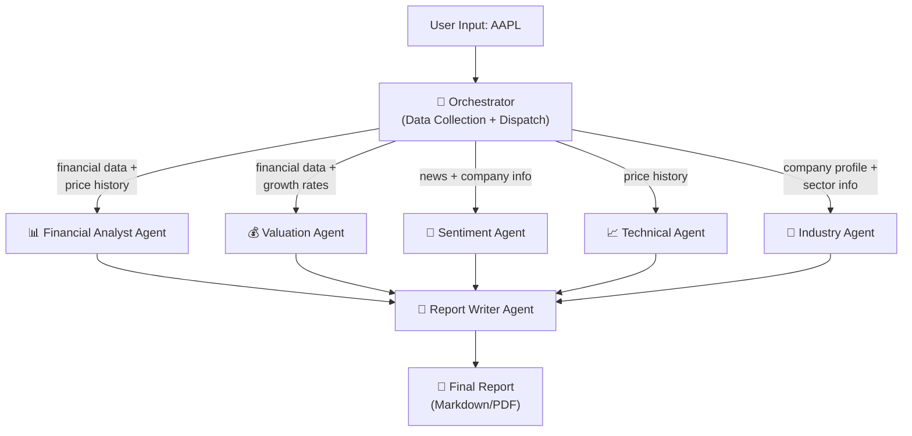

# Equity Research Multi-Agent System — Architecture Recommendation

## Your Key Questions Answered

### Can we get financial statements for free for all stocks?

**Yes — `yfinance` gives you income statements, balance sheets & cash flow for any publicly traded ticker, completely free.** Here's what it provides:

| Data | Method | Coverage |
|---|---|---|
| Income Statement | `ticker.income_stmt` | ~4 years, annual + quarterly |
| Balance Sheet | `ticker.balance_sheet` | ~4 years, annual + quarterly |
| Cash Flow | `ticker.cashflow` | ~4 years, annual + quarterly |
| Key Ratios | `ticker.info` | P/E, EV/EBITDA, Beta, ROE, etc. |
| Price History | `ticker.history()` | Full history |
| Analyst Targets | `ticker.analyst_price_targets` | Current consensus |
| News | `ticker.news` | Recent headlines |

**Limitations to know about:**
- Rate limited to ~2,000 requests/hour per IP (no problem for single-ticker analysis)
- Data goes back ~4 years only for financials
- It's unofficial (scrapes Yahoo Finance), so can occasionally break
- Some microcaps or international tickers may have gaps

> **Bottom line: for a single-company research report, `yfinance` gives you everything you need for free.**

---

### Should we combine the Orchestrator + Financial Data Agent?

**Yes — this is the smarter design.** Here's why:

A separate "data agent" that just fetches data adds unnecessary complexity. The data fetching is a **deterministic task** (call API → get DataFrame) — it doesn't need an LLM to decide what to do. Making it a full "agent" is over-engineering.

**Better pattern:** The Orchestrator collects ALL raw data upfront, then distributes it to specialist analysis agents. This means:
- ✅ One API call session (no redundant fetches)
- ✅ All agents work from a consistent data snapshot
- ✅ Simpler architecture, fewer failure points
- ✅ Easier to debug

---

## Recommended Architecture

### The "Hub and Spoke" Pattern



### Why this works:
1. **Orchestrator is NOT an LLM agent** — it's pure Python logic that fetches data and routes it
2. **Analysis agents ARE LLM agents** — they interpret data and write narrative
3. **Report Writer is an LLM agent** — it synthesizes everything into a cohesive report

---

## The Agents in Detail

### 🎯 Orchestrator (Python — no LLM needed)
**Role:** Data collection + task dispatch + result aggregation

```
Input: ticker string
Actions:
  1. Validate ticker exists
  2. Fetch ALL data from yfinance in one session
  3. Package data into context bundles for each agent
  4. Dispatch agents (can run in parallel)
  5. Collect results
  6. Pass to Report Writer
Output: compiled agent results
```

**Data it collects in one pass:**
- `ticker.info` → company profile, sector, market cap, ratios
- `ticker.income_stmt` → revenue, net income, margins
- `ticker.balance_sheet` → assets, liabilities, equity
- `ticker.cashflow` → operating/investing/financing flows
- `ticker.history(period="1y")` → price + volume data
- `ticker.news` → recent headlines
- `ticker.analyst_price_targets` → consensus targets
- `ticker.recommendations` → analyst ratings

### 📊 Financial Analyst Agent (LLM)
**Input:** Income statement, balance sheet, cash flow, key ratios
**Output:** Revenue trends, margin analysis, profitability, leverage, working capital, earnings quality
**Prompt Pattern:** "You are a senior equity research analyst. Analyze these financials and highlight key trends, strengths, and red flags."

### 💰 Valuation Agent (LLM + calculations)
**Input:** Financial data + current price + growth rates + analyst targets
**Output:** Relative valuation (P/E, EV/EBITDA vs. peers), simple DCF, comparison to analyst consensus
**Prompt Pattern:** "You are a valuation specialist. Based on these financials, compute and interpret valuation metrics."

### 📰 Sentiment Agent (LLM)
**Input:** News headlines, analyst recommendations
**Output:** News sentiment summary, key themes, catalysts/risks
**Prompt Pattern:** "You are a market intelligence analyst. Summarize recent news and assess market sentiment."

### 📈 Technical Agent (LLM + Python calculations)
**Input:** Historical price/volume data
**Output:** Trend analysis, support/resistance, key indicators (RSI, MACD, MAs), chart
**Note:** This agent uses Python tools to calculate indicators and generate charts, then the LLM interprets them.

### 🏢 Industry & Competitive Agent (LLM)
**Input:** Company profile, sector info, market cap
**Output:** Competitive positioning, industry trends, moat analysis
**Prompt Pattern:** "You are a sector analyst. Based on this company's profile, analyze its competitive position and industry dynamics."

### 📝 Report Writer Agent (LLM)
**Input:** All agent outputs
**Output:** Final cohesive equity research report
**Prompt Pattern:** "You are a senior research editor. Compile these analyses into a professional equity research report with executive summary and investment recommendation."

---

## Framework Recommendation: **CrewAI**

After comparing the three main options:

| | CrewAI | LangGraph | AutoGen |
|---|---|---|---|
| **Learning Curve** | Low ✅ | High ❌ | Medium |
| **Role-based agents** | Native ✅ | Manual | Manual |
| **Parallel execution** | Built-in ✅ | Built-in | Built-in |
| **Best for** | Structured workflows ✅ | Complex state machines | Chat-based collab |
| **Overkill risk** | Low | High for this use case | Medium |
| **Community examples** | Many finance examples ✅ | Some | Few for finance |

**CrewAI is ideal because:**
- The equity research problem maps perfectly to "a team of specialists with defined roles"
- There's already a stock analysis example in their official repo
- The role-goal-backstory agent definition is intuitive
- Sequential + parallel task support out of the box
- Easy to add/remove agents as we iterate

---

## Project Structure

```
kereneye/
├── README.md
├── requirements.txt
├── main.py                          # Entry point
├── config.py                        # API keys, model settings
│
├── data/
│   └── collector.py                 # Orchestrator: yfinance data fetching
│
├── agents/
│   ├── financial_analyst.py         # Financial analysis agent
│   ├── valuation_analyst.py         # Valuation agent  
│   ├── sentiment_analyst.py         # News & sentiment agent
│   ├── technical_analyst.py         # Technical analysis agent
│   ├── industry_analyst.py          # Industry & competitive agent
│   └── report_writer.py            # Final report compilation agent
│
├── tools/
│   ├── financial_tools.py           # Ratio calculations, formatting
│   ├── technical_tools.py           # RSI, MACD, MA calculations
│   └── chart_tools.py              # Plotly/matplotlib chart generation
│
├── crew/
│   └── research_crew.py            # CrewAI crew definition & task orchestration
│
└── output/
    └── reports/                     # Generated reports saved here
```

---

## What Makes This Architecture Good (for grading)

1. **Clear separation of concerns** — data collection is decoupled from analysis
2. **Hub-and-spoke pattern** — well-documented architecture pattern
3. **Agents are truly specialized** — each has a clear role and bounded responsibility
4. **Smart use of LLMs** — only where interpretation/reasoning is needed (not for API calls)
5. **Deterministic orchestrator** — no LLM non-determinism in the control flow
6. **Scalable** — easy to add new agents (e.g., ESG agent, Options agent) without changing existing code
7. **Free data pipeline** — `yfinance` covers everything needed, no paid APIs required
8. **Reproducible** — same ticker always fetches same data snapshot, agents run against consistent state

---

## Next Steps

Once you approve this architecture, I'll:
1. Set up the project with `requirements.txt` and project skeleton
2. Build the data collector (orchestrator)
3. Implement agents one by one with CrewAI
4. Build the report writer
5. Create a polished README
6. Test end-to-end with a real ticker
